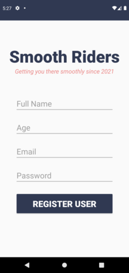
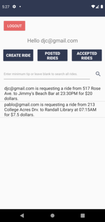
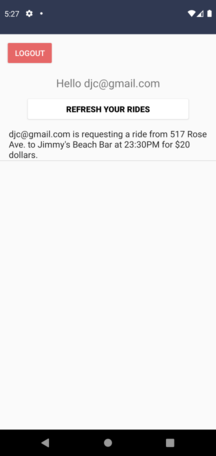
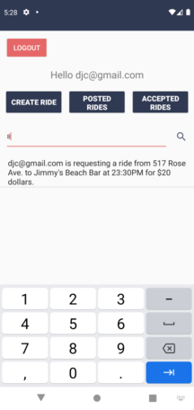

# SmoothRiders

<h2 align="center">Login</h2>

  

 

<h2 align="center">Register User</h2>

  

 

<h2 align="center">Reset Password</h2>

  

 

<h2 align="center">Main Activity</h2>

  

 

<h2 align="center">Create a Ride Request</h2>

  

 

<h2 align="center">View Ride Info</h2>

  

 

<h2 align="center">View Rides that you have Accepted</h2>

  

 

<h2 align="center">View Rides that you have Posted</h2>

  

 

<h2 align="center">Filter Rides by Minimum Price</h2>

  

